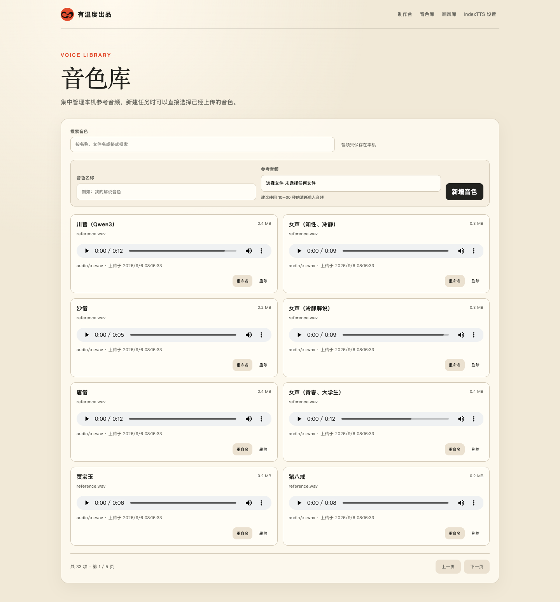
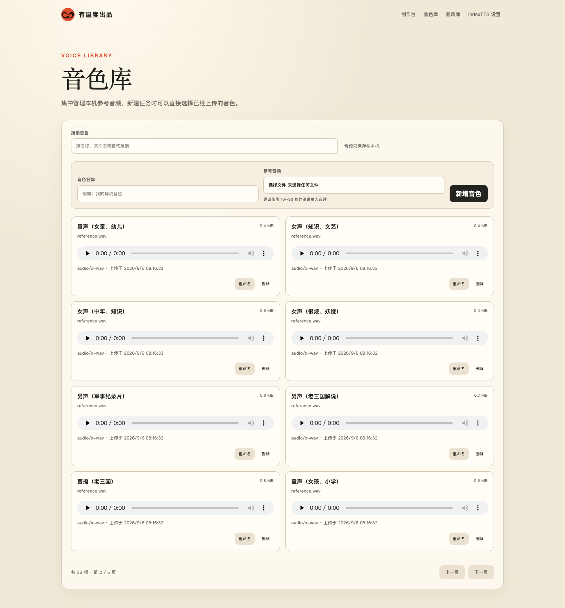
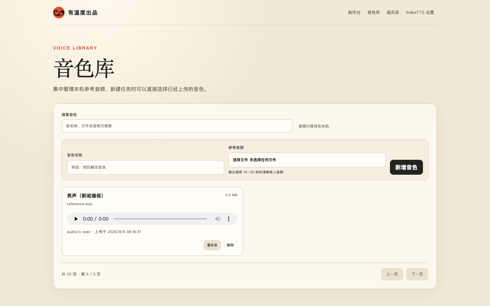
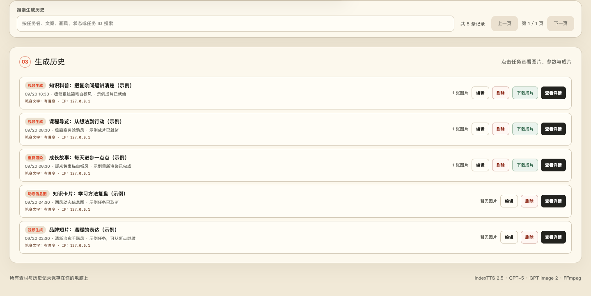
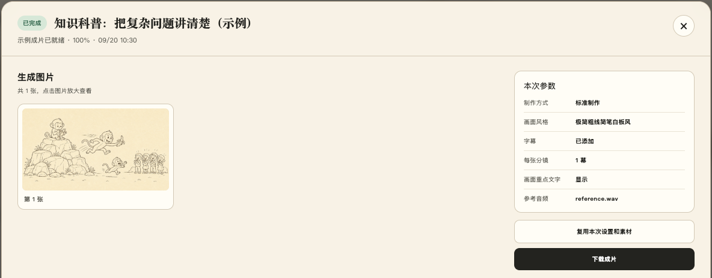
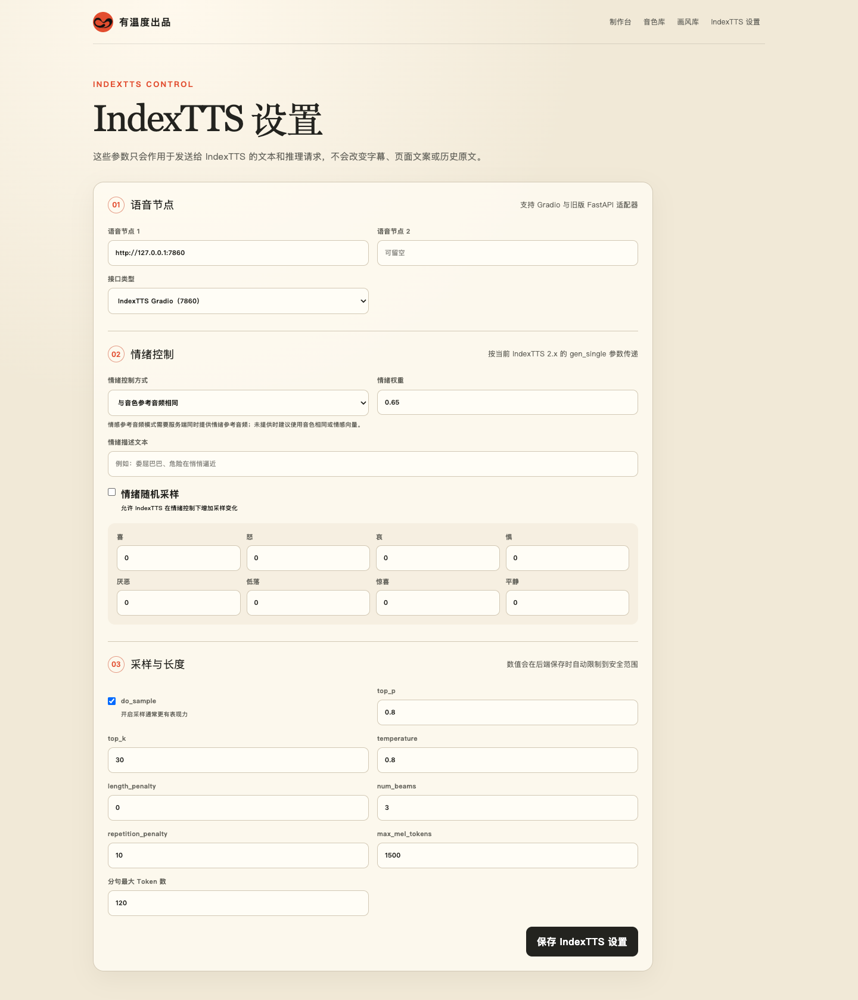
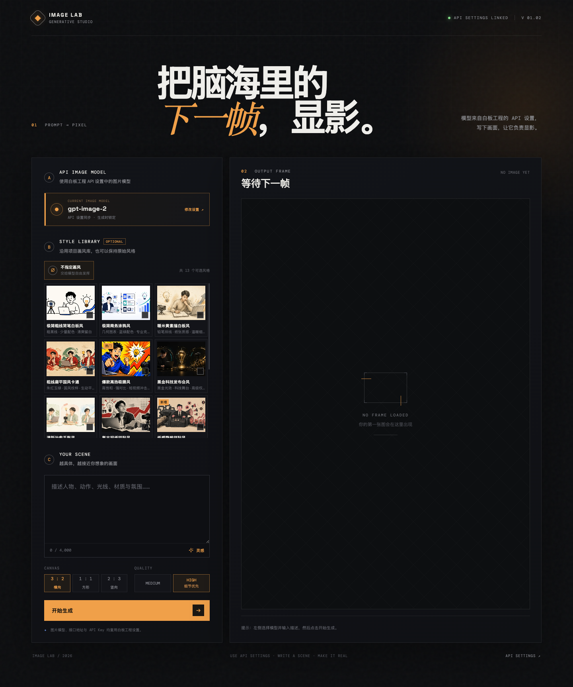

# 有温度出品｜白板声画工坊

> 把你的表达，做成一支会说话的视频。

白板声画工坊是一个本地运行的 AI 视频制作工作台。上传一段参考音频、粘贴中文文案，选择视觉模板或提供人物与风格参考，系统会自动完成音色克隆、内容拆解、插画、手绘笔迹、字幕与音画合成，并导出 MP4。

素材、密钥、任务历史和成片默认都保留在本机；同一局域网内的团队也可以共用一条制作队列。


## 你可以用它做什么

```text
参考音频 + 中文文案 +（可选）风格 / 人物参考
                    ↓
音色克隆 → 内容拆解 → 统一画面 → 动画渲染 → 字幕与音画合成
                    ↓
                 MP4 成片
```

| 制作模式 | 适合什么 | 你得到什么 |
| --- | --- | --- |
| 标准制作 | 知识讲解、故事口播、课程宣传 | 自动拆分分镜，生成插画并绘制白板动画。 |
| 自定义参考 | 固定 IP、品牌视频、系列内容 | 上传一张风格图和人物参考，让画风与角色贯穿全片。 |
| 动态信息图 | 观点表达、商业分析、课程内容 | 根据真实旁白时间生成随讲解展开的动态知识卡片。 |

## 近期改动

- **音色库独立管理**：集中上传、试听、搜索和分页浏览参考音频，支持重命名、删除，并在制作台直接复用。
- **画风库统一管理**：内置与自定义画风统一展示，支持搜索、分页、预览和完整字段详情；可编辑生成配方，为自定义画风上传预览图。
- **生成历史与任务详情**：搜索历史任务，查看生成图片、制作参数、参考素材与成片；复用设置重新制作，或修改单张图片提示词后重新生成。
- **独立 IndexTTS 设置**：集中配置语音节点、情绪控制和推理参数；最终 MP4 可另存到指定输出目录。
- **新增文生图工作台**：通过 `/image-generator` 单独生成图片，复用 API 设置与画风库，支持尺寸、质量选择和 PNG 下载，无需先提交视频任务。
- **手绘节奏优化**：将相邻笔画按对象分组，结合笔画长度与转折复杂度分配绘制时间，减少跨对象跳笔。

## 核心能力

| 能力 | 说明 |
| --- | --- |
| 本地音色克隆 | 接入自己的 IndexTTS Gradio 或 FastAPI 服务，参考音频不离开本机。 |
| 音色库 | 可保存多条本地参考音色；新建任务时可直接选择，支持新增、重命名和删除。 |
| 12 个视觉模板 | 从极简白板、国风、手账到赛博霓虹；每个模板都有对应的画面特征和内容建议。 |
| 自定义人物与画风 | 支持 1 张风格参考图，以及最多 5 个角色、每人 1–3 张参考图。 |
| 动态信息图 | 先将旁白对齐为短语时间表，再按真实说话时间逐项呈现内容，避免画面抢跑。 |
| 中文重点词 | 可本地叠加 4–10 字重点短语，避开图片模型生成中文容易乱码的问题；支持一键关闭。 |
| 可控成片节奏 | 支持 `16:9` 横屏、`9:16` 竖屏和 `1:1` 方形比例，另有字幕开关、笔身账号名、4 档线条绘制量，以及每张图承载 1–4 个分镜。 |
| 任务复用与恢复 | 配音、分镜、图片、分段视频与成片均有检查点；调整本地渲染设置时无需重复调用模型。 |
| 输出目录与历史管理 | 可在 API 设置中指定最终 MP4 输出目录；支持按关键字搜索、分页、编辑历史任务参数，以及删除已结束任务及其本地素材。 |
| 独立资源页面 | 音色库、画风库和 IndexTTS 参数分别拥有独立页面，音色与画风页面支持搜索和分页。 |
| 画面风格库 | 内置风格可编辑但不可删除；也可新增、编辑、删除自定义风格，并保存生成配方和预览图；详情页展示全部字段。 |
| 局域网协作 | 多台电脑可查看共享队列、进度和历史；个人制作偏好保留在各自浏览器。 |
| 独立文生图 | 在 `/image-generator` 输入提示词，可选共享画风库中的风格，使用已配置的图片模型生成并下载 PNG。 |
| 对象级手绘节奏 | 相邻笔画按对象连续绘制，结合笔画复杂度分配时间，让绘制过程更连贯。 |

## 界面预览

以下为当前本地版本的实际界面截图。音色库展示本机已导入的 33 个真实音色；历史任务使用独立示例数据，任务详情中的图片与视频来自仓库 `examples/`。仓库只收录截图，不附带参考音频，也不展示 API Key 或真实业务任务。

### 音色库

集中管理参考音频：搜索、试听、新增、重命名和删除；保存的音色可在制作台直接选择。

下图展示本机已导入的 **33 个音色，共 5 页**，包括孙悟空、猪八戒、唐僧、沙僧、林黛玉、贾宝玉、曹操、佩奇、蜡笔小新，以及新闻播报、纪录片解说、童声等音色。这些是本地音色库内容，并非新安装后默认附带的音频。

**第 1 页 · 川普（Qwen3）、知性女声、沙僧、唐僧、贾宝玉、猪八戒等**



<details>
<summary>展开其余 4 页，查看全部 33 个音色</summary>

**第 2 页 · 幼儿童声、知识女声、军事纪录片、老三国解说、曹操等**



**第 3 页 · 带货女声、朗读男声、新闻播报、麦克阿瑟、曼波、林黛玉等**


**第 4 页 · 孙悟空、温柔女声、哲理解说、宣传片、足球解说、佩奇、蜡笔小新等**


**第 5 页 · 新闻播报男声**



</details>

### 画风库

统一浏览内置与自定义画风，查看预览图、简介和生成配方；支持搜索、分页、编辑及详情查看。


### 生成历史

在制作台下方搜索和分页浏览历史任务，可编辑、删除、下载成片或打开详情；执行中的任务可先取消。



<details>
<summary>展开查看：任务详情、IndexTTS 设置与文生图工作台</summary>

### 任务详情

查看生成图片、本次参数、参考素材和最终成片，并将设置与素材载入制作台复用。生成图片支持放大查看；需要局部调整时，可修改对应提示词，只重新生成那一张图片。



### IndexTTS 设置

独立管理语音节点、接口类型、情绪控制、采样与推理参数，保存后在下一次生成时生效。



### 文生图工作台

填写提示词，选择画风、图片尺寸和质量，生成后预览并下载 PNG。模型与密钥统一读取制作台的 API 设置；截图展示的是尚未配置密钥的初始状态。



</details>

## 视觉模板

选择模板会同时影响插画的配色、线条、材质与构图。预览图展示的是视觉方向；实际人物、物体和场景会随文案变化。

| 模板 | 预览 | 画面特征 | 推荐内容 |
| --- | --- | --- | --- |
| **极简粗线简笔白板风** |  | 粗黑线、少量配色、清爽留白 | 知识讲解、个人表达、复盘总结 |
| **极简商务涂鸦风** |  | 几何图表、蓝绿配色、专业克制 | 产品介绍、商业分析、项目汇报 |
| **暖米黄素描白板风** |  | 铅笔排线、纸张质感、温暖细腻 | 人物故事、个人成长、品牌叙事 |
| **粗线扁平国风卡通** |  | 朱红玉绿、国风纹样、生动平涂 | 传统文化、国风品牌、中文创意 |
| **爆款高热吸睛风** |  | 高饱和、强对比、夸张动势 | 短视频开场、强观点、热点表达 |
| **黑金科技发布会风** |  | 黑金光效、科技舞台、高级权威 | AI、科技产品、发布会 |
| **清新治愈手账风** |  | 柔和水彩、低饱和配色、生活手账感 | 情感、生活方式、自我成长 |
| **复古报纸拼贴风** |  | 撕纸拼贴、半色调、编辑杂志感 | 深度观点、文化内容、案例复盘 |
| **纸感隐喻拼贴风** |  | 手工剪纸、观点隐喻、高级克制 | 价值观、关系、流程、复杂观点 |
| **漫画墨线解释风** |  | 漫画墨线、半调网点、概念机制 | 原理讲解、机制拆解、商业洞察 |
| **3D黏土趣味风** |  | 黏土材质、玩具比例、温暖可爱 | 亲子教育、轻量品牌、趣味科普 |
| **赛博霓虹漫画风** |  | 霓虹青紫、漫画速度线、未来感 | AI 趋势、数码科技、年轻化观点 |

> 模板预览使用 GitHub Raw 地址，避免 README 中的表格图片因相对路径无法渲染。当前前端实际提供 12 个模板；如果你只记得原来的 11 个，新增的是「漫画墨线解释风」。

## 5 分钟启动

### 环境要求

- Windows 10/11（提供 PowerShell 一键启动脚本）
- macOS 15+（Intel 与 Apple Silicon，提供 shell 一键启动脚本；Remotion 视频渲染要求）
- Python 3.11+
- Node.js 22.13+
- FFmpeg 与 FFprobe，且已加入系统 `PATH`
- 可访问的 IndexTTS 2.5 服务（Gradio 或 FastAPI）
- OpenLux API Key，并有文本模型与图片模型的调用权限

先确认音视频依赖可用。

macOS/Linux：

```bash
ffmpeg -version
ffprobe -version
```

Windows PowerShell：

```powershell
ffmpeg -version
ffprobe -version
```

### Windows

在项目根目录执行一次安装：

```powershell
python scripts/prepare_env.py
.\.venv\Scripts\python.exe -m pip install -r webapp\requirements.txt
Push-Location web
npm ci
Pop-Location
```

然后启动工作台：

```powershell
.\start-webapp.ps1
```

脚本会启动前后端并打开 [http://127.0.0.1:13000/](http://127.0.0.1:13000/)。同一局域网设备也可以通过脚本输出的地址访问。

### macOS

先安装 Python 3.11+、Node.js 22.13+、FFmpeg 与 FFprobe。使用 Homebrew 时可以执行：

```bash
brew install python@3.13 node ffmpeg
```

在项目根目录执行一次安装：

```bash
python3.13 scripts/prepare_env.py
.venv/bin/python -m pip install -r webapp/requirements.txt
(cd web && npm ci)
```

国内网络安装 Python 依赖较慢时，可以只对当前命令使用清华 PyPI 镜像：

```bash
PIP_INDEX_URL=https://pypi.tuna.tsinghua.edu.cn/simple python3.13 scripts/prepare_env.py
PIP_INDEX_URL=https://pypi.tuna.tsinghua.edu.cn/simple .venv/bin/python -m pip install -r webapp/requirements.txt
```

然后启动工作台：

```bash
./start-webapp.sh
```

网页版与 macOS DMG 使用相同的本地端口（`13000` 和 `18765`），启动网页版前请先退出 **CSBoard.app**；启动脚本会检测端口占用并给出提示，不会误连接到 DMG 的服务。

脚本会启动前后端并打开 [http://127.0.0.1:13000/](http://127.0.0.1:13000/)。如果系统没有自动打开浏览器，也可以手动访问该地址。动态信息图首次运行时会按当前平台准备 Remotion 与 Whisper.cpp 所需资源。macOS 14 及更低版本可以启动界面和 API，但当前 Remotion 版本的视频渲染不保证成功。

### 首次配置

打开右上角的 **API 设置**，填写并测试以下内容：

1. **OpenLux API Key**：只保存在本机 `.webapp/config.json`，页面不会回显完整密钥。
2. **文本模型**：默认 `gpt-5`，用于拆解文案、生成分镜或信息图结构。
3. **图片模型**：默认 `gpt-image-2`，用于生成插画。
4. **IndexTTS 地址与接口类型**：Gradio 通常为 `http://127.0.0.1:7860`，FastAPI 通常为 `8000` 端口。
5. **视频输出目录**：macOS 可点击“选择文件夹”打开系统目录选择器，也可以填写 macOS/Windows 上的绝对路径；留空时最终视频只保存在任务历史目录。设置后只复制最终 MP4，中间图片、音频和检查点仍保存在 `.webapp/jobs/<任务 ID>/`。

测试连接成功后，上传 10–30 秒、单人且噪声较少的参考音频，粘贴至少 10 个字的中文文案，选择制作模式和视觉模板即可开始。

### 独立资源页面

- **音色库**：访问 `/voices`，按名称、文件名或格式搜索，分页浏览并试听本机参考音频；支持新增、重命名和删除。音色保存在本机 `.webapp/voices/`，新建任务时仍可直接选择。
- **画风库**：访问 `/styles`，按名称、别名、简介或生成配方搜索，分页浏览全部内置与自定义画风。点击“查看详情”会展示 `id`、名称、别名、类型、内置/自定义标记、删除标记、简介、配方、预览图字段、图片 URL 和创建/更新时间等全部字段。
- **IndexTTS 设置**：访问 `/tts`，单独配置节点、情绪控制方式、情绪权重、八维情绪向量、情绪描述文本、随机采样，以及 `top_p`、`top_k`、`temperature`、`num_beams` 等推理参数。参数保存在 `.webapp/config.json`，下一次生成时生效。
- **文生图工作台**：访问 `/image-generator`，使用制作台 API 设置中的 OpenLux 地址、密钥和图片模型，输入提示词并按需选择已有画风、尺寸与质量。生成结果可预览、下载 PNG；最近 4 张结果仅保留在当前页面会话中，刷新后不会进入视频任务历史。

### 音色库

任务提交时会将音色复制到自己的任务目录，因此之后删除或重命名音色不会影响已经生成的历史任务。

### TTS 文本预处理

系统只会处理发送给 IndexTTS 的文本，原文仍用于分镜、页面内容和字幕。生成语音前会自动保护 `GPT-5`、`Qwen3-TTS` 等技术术语，并将普通连字符按上下文转换：数字范围如 `3-5` 转为“3到5”，负数如 `-2` 转为“负2”，其他连字符转为停顿。

多音字短语写在项目根目录的 `pronunciation.yaml` 中，下一次生成时自动读取。例如：

```yaml
phrases:
  - phrase: 银行
    char: 行
    pinyin: HANG2
```

这样“银行”会只在 TTS 文本中转换为“银`<行|HANG2>`”；分镜、页面和字幕仍保留原文。需要新增读音时，增加一条包含 `phrase`、`char` 和 `pinyin` 的规则即可。

## 使用建议

### 标准制作

适合先快速验证一个内容方向：选择模板，上传音频和文案，系统会将内容拆成场景、生成统一画面并合成白板动画。

### 自定义参考

适合固定 IP 或品牌化内容：上传一张风格参考图，再添加 1–5 个角色。每个角色可上传 1–3 张不同角度的参考图；系统会按文案安排角色，不会直接复制参考图中的人物。

### 动态信息图

适合需要“边讲边理解”的内容。系统先依据真实旁白生成短语时间表，再生成章节、核心观点和图文结构；内容元素只会在对应的语音开始后出现。详细原则见 [动态信息图语义时间契约](docs/semantic-timing-contract.md)。

### 编辑与删除历史

在“生成历史”上方输入关键字，可以按任务名、文案、画风、状态或任务 ID 搜索，并使用分页按钮浏览结果。点击任务的“查看详情”，可以选择“复用本次设置和素材”把文案、参考音频、视觉参考与成片设置载入制作页，修改后重新生成。已完成、失败或已取消的任务可以点击“删除”；排队中或制作中的任务需要先取消。删除会清理该任务的本地素材、分镜、检查点和成片；如果配置了输出目录，也会一并删除对应的最终 MP4。

## 运行与数据

所有本地配置、任务文件和成片均保存在 `.webapp/`：

```text
.webapp/
├── config.json          # 本机 API 与语音配置
├── preferences.json     # 兼容旧版偏好
├── voices/<音色 ID>/     # 音色库中的参考音频与元数据
├── styles.json          # 画风库元数据、生成配方与内置画风修改
├── styles/<画风 ID>/     # 上传的画风预览图
└── jobs/<任务 ID>/       # 音频、分镜、图片、检查点、成片与任务元数据
```

配置了视频输出目录后，最终文件会以 `whiteboard-<任务 ID>.mp4` 保存到该目录；任务元数据会记录实际路径，因此之后修改输出目录不会影响已有历史任务的下载。

`.webapp/`、`.env*`、虚拟环境、`node_modules` 与视频产物都已被 Git 忽略。不要在 Issue、日志、截图或提交记录中公开 API Key、参考音频和任务目录；安全问题请按 [SECURITY.md](SECURITY.md) 中的方式私下报告。

## 开发验证

### macOS/Linux

```bash
# 前端构建与页面验证
(cd web && npm test)

# 后端任务队列、断点恢复与时间线测试
.venv/bin/python -m unittest discover -s tests -v

# Remotion 类型检查
(cd video_renderer && npm run build)
```

### Windows PowerShell

```powershell
# 前端构建与页面验证
Push-Location web
npm test
Pop-Location

# 后端任务队列、断点恢复与时间线测试
.\.venv\Scripts\python.exe -m unittest discover -s tests -v

# Remotion 类型检查
Push-Location video_renderer
npm run build
Pop-Location
```

## 项目结构

```text
├── assets/               # 画笔、视觉风格与参考素材
├── docs/                 # 界面截图、动态信息图与工作流文档
├── examples/             # 白板动画示例
├── scripts/              # 白板渲染、时间线与维护脚本
├── tests/                # 队列、恢复与语义时间测试
├── video_renderer/       # Remotion 动态信息图渲染器
├── web/                  # React 前端
├── webapp/               # FastAPI 后端
├── start-webapp.ps1      # Windows 一键启动
└── start-webapp.sh       # macOS/Linux 一键启动
```

## 贡献

欢迎提交 Issue 或 Pull Request。涉及渲染逻辑的改动，请同时说明真实素材下的时序、遮罩保护和最终成片验证结果。

## 许可证

本项目采用 [MIT License](LICENSE)。
